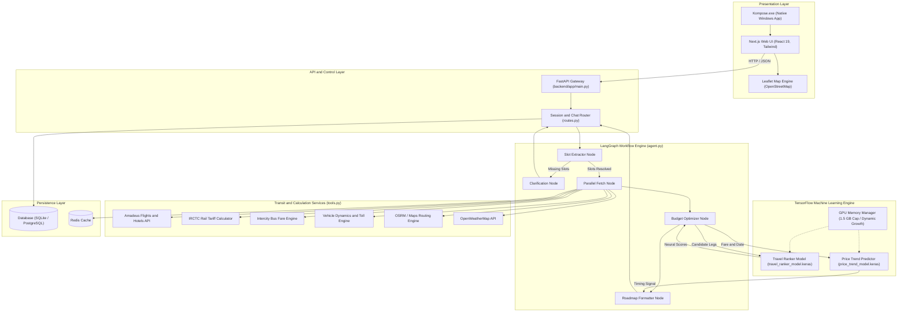
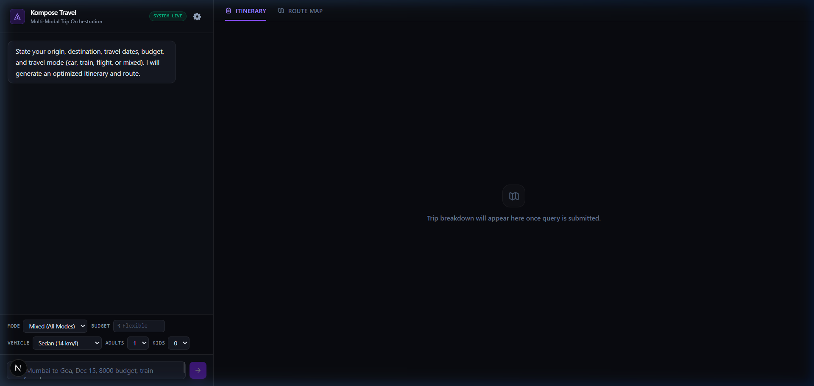
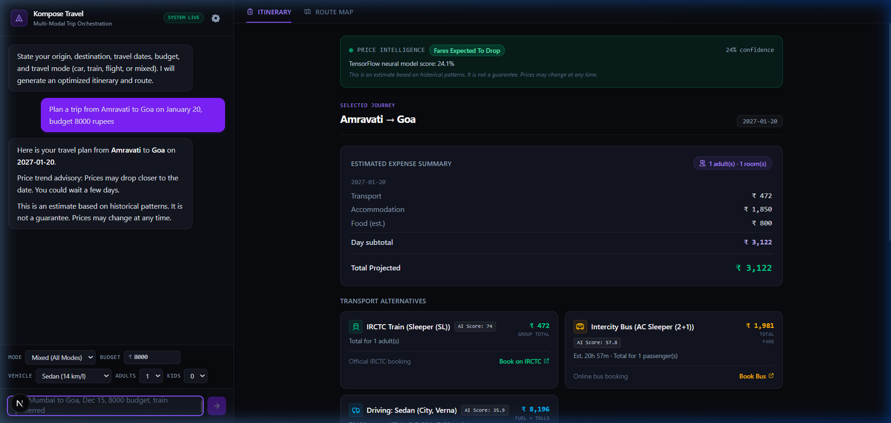
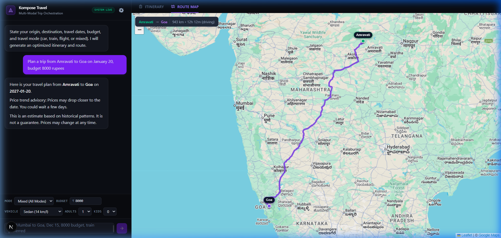
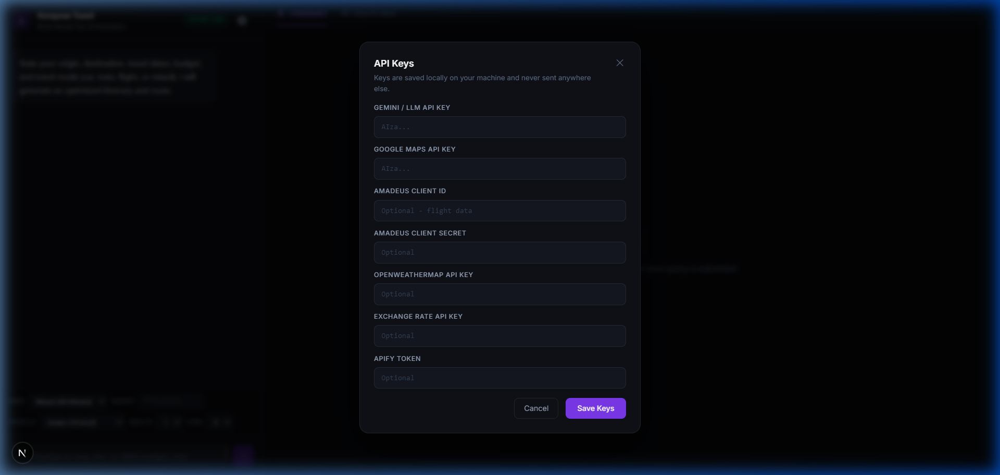
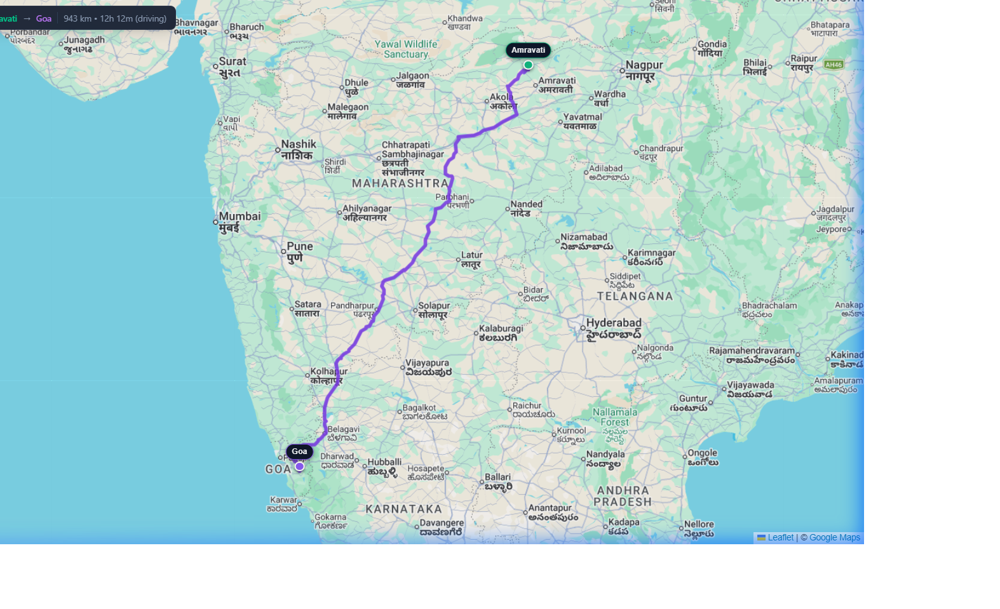

# Kompose

Multi-modal travel planning engine that orchestrates flight, train, bus, car, and hotel options into an optimized itinerary with neural price timing signals.

## System Architecture



### Component Flow Overview

```text
+--------------------------------------------------------------------------+
|                        PRESENTATION LAYER                                |
|   Kompose.exe (Windows Desktop)  |  Next.js 16 Web Client (Port 3000)    |
|   - Chat Interface               |  - Leaflet / OpenStreetMap Route View |
+-------------------------------------+------------------------------------+
                                      | HTTP POST /api/chat
+-------------------------------------v------------------------------------+
|                         API GATEWAY (FastAPI)                            |
|   - Multi-turn context resolution   - Session history database lookup    |
+-------------------------------------+------------------------------------+
                                      | StateGraph invocation
+-------------------------------------v------------------------------------+
|                     LANGGRAPH WORKFLOW ENGINE                            |
|                                                                          |
|   [Slot Extractor] ---> (Slots missing?) --- Yes ---> [Clarify Node]     |
|          |                                                    |          |
|          +------------ No (Complete)                          |          |
|          |                                                    |          |
|          v                                                    v          |
|   [Parallel Fetch] <=== Concurrent Calls ===> [External APIs / Engines]  |
|          |                                    - Amadeus Flights & Hotels |
|          v                                    - IRCTC Rail Fare Engine   |
|   [Budget Optimizer]                          - Intercity Bus Engine     |
|          |                                    - Vehicle Fuel & Tolls     |
|          +<===> [TensorFlow Travel Ranker]    - OSRM / Geocoding         |
|          |      Scores transit modes (0-100)                             |
|          v                                                               |
|   [Price Trend Node] <==> [TensorFlow Price Predictor]                   |
|          |                Forecasts fare trajectory (book_now/wait)      |
|          v                                                               |
|   [Roadmap Formatter] ===> Persist Messages & Fares ===> Response Payload|
+--------------------------------------------------------------------------+
```

## Features

- **Multi-Modal Transit Comparison**: Evaluates and displays concurrent options for Flights, Indian Railways (IRCTC across Sleeper, 3A, 2A, 1A), Intercity Buses (Express Seater, AC Sleeper, Volvo), and Driving (fuel consumption profiles for Hatchback, Sedan, SUV, EV + toll estimations).
- **Conversational Slot Persistence**: Multi-turn dialogue with context preservation across conversation turns. Resolves missing parameters (origin, destination, departure date) dynamically.
- **TensorFlow Route Ranker**: Evaluates cost, travel duration, distance, passenger count, and budget ratio using a neural network to identify top-value travel recommendations.
- **TensorFlow Price Trend Predictor**: Forecasts fare trajectory (book now vs. wait vs. neutral) with confidence scores using historical fare observations and seasonal patterns.
- **Interactive Route Map**: Leaflet integration with Google Maps tiles (OSM fallback), waypoints, and route paths.
- **API Key Settings**: Gear icon in the UI opens a settings modal to save personal API keys locally - no config files needed.
- **Windows Desktop Application**: Native standalone Windows executable (`Kompose.exe`) that manages backend and frontend services with a borderless desktop window and system tray controls.

## Screenshots

**Landing UI**


**Trip Plan - Amravati to Goa (₹8,000 budget)**


**Route Map with Google Maps tiles**


**API Key Settings**


**Route Detail View**



## Requirements

- Python 3.11+
- Node.js 20+
- Optional: NVIDIA GPU (TensorFlow is configured with dynamic memory growth and a 1.5 GB VRAM cap for 6 GB GPUs)

## Setup and Installation

### 1. Repository Configuration

Clone the repository and prepare environment files:

```bash
git clone <repository-url>
cd Kompose
cp .env.example .env
```

Set the required environment keys in `.env`:
- `LLM_API_KEY`: API key for model inference
- `AMADEUS_CLIENT_ID` / `AMADEUS_CLIENT_SECRET`: Flight and hotel search credentials
- `GOOGLE_MAPS_API_KEY`: Directions and geocoding (optional, OSRM and Nominatim are used as free fallbacks)
- `OPENWEATHER_API_KEY`: Weather forecast data (optional)

### 2. Backend Setup

```bash
cd backend
python -m venv venv
venv\Scripts\activate      # On Linux/macOS: source venv/bin/activate
pip install -r requirements.txt
```

Database tables are automatically created on startup using local SQLite (`travel_planner.db`).

### 3. Frontend Setup

```bash
cd frontend
npm install
```

## Running the Application

### Option A: Windows Native Desktop Executable

A standalone Windows executable is available in the root folder:

```text
Kompose.exe
```

Double-clicking `Kompose.exe` will:
1. Verify and start the FastAPI backend service in the background.
2. Verify and start the Next.js frontend service.
3. Open a dedicated desktop window without browser URL bars or tabs.
4. Place a system tray icon with controls to reopen the window, restart services, or cleanly terminate all processes on exit.

To rebuild `Kompose.exe` from source using the Windows native C# compiler:

```cmd
C:\Windows\Microsoft.NET\Framework64\v4.0.30319\csc.exe /target:winexe /win32icon:frontend\src\app\favicon.ico /out:Kompose.exe /reference:System.Windows.Forms.dll,System.Drawing.dll,System.dll,System.Core.dll desktop_launcher.cs
```

### Option B: Terminal Dev Servers

Start backend service:

```bash
cd backend
venv\Scripts\activate
uvicorn app.main:app --reload --port 8000
```

Start frontend service:

```bash
cd frontend
npm run dev
```

Open `http://localhost:3000` in your web browser.

## Machine Learning Models

Kompose includes two local TensorFlow neural network models stored in `backend/models/`:

1. **Price Trend Predictor (`price_trend_model.keras`)**:
   - Inputs: Current price, days to departure, day of week, month, peak season indicator.
   - Output: Probability score mapped to booking recommendations (`book_now`, `wait`, `neutral`).

2. **Travel Route Ranker (`travel_ranker_model.keras`)**:
   - Inputs: Transport mode index, total cost, duration hours, road distance, passenger count, budget ratio.
   - Output: Value score (0 to 100) used to rank options and select the top pick.

To retrain the models locally using workspace files and the 1.5 GB VRAM memory safety profile:

```bash
cd backend
venv\Scripts\python.exe train_models.py
```

## API Reference

### Chat and Planning
- `POST /api/chat`
  - Request body:
    ```json
    {
      "session_id": "optional-uuid",
      "message": "Trip from Delhi to Mumbai on 2026-10-15",
      "origin": "Delhi",
      "destination": "Mumbai",
      "travel_date": "2026-10-15",
      "budget": 15000,
      "mode_preference": "mixed",
      "adults": 1,
      "children": 0,
      "car_type": "sedan"
    }
    ```
  - Response: Contains assistant reply, clarification status, price signal advisory, and full roadmap legs (transport options, hotel cards, cost breakdown).

### Session History
- `GET /api/session/{session_id}/history`
  - Returns message history for the given session.

### Health
- `GET /health`
  - Service status probe.

## Project Structure

```text
Kompose/
├── Kompose.exe                 # Windows desktop launcher executable
├── desktop_launcher.cs         # C# source for desktop executable
├── docker-compose.yml          # Optional container configuration
├── backend/
│   ├── app/
│   │   ├── agent.py            # LangGraph workflow definition and state
│   │   ├── config.py           # Configuration and environment settings
│   │   ├── database.py         # SQLAlchemy engine and session provider
│   │   ├── models.py           # Database entities (TripQuery, FareRecord, etc.)
│   │   ├── price_trend.py      # TensorFlow price prediction inference module
│   │   ├── routes.py           # FastAPI routes and chat endpoints
│   │   ├── tools.py            # External API tools and transit fare models
│   │   └── travel_ranker.py    # TensorFlow multi-modal option ranker
│   ├── models/                 # Saved TensorFlow .keras models
│   ├── train_models.py         # Local TensorFlow training script
│   └── pyproject.toml          # Python project dependencies
├── frontend/
│   ├── src/
│   │   ├── app/                # Next.js app router and page layout
│   │   ├── components/         # React UI components (TravelPlanner, RoadmapView, MapView)
│   │   ├── lib/                # API client helpers
│   │   └── types/              # TypeScript interfaces
│   └── package.json            # Node.js dependencies
└── train/
    └── kaggle_train.py         # Kaggle GPU training script
```

## License

MIT License
